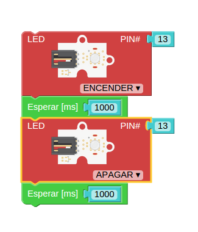
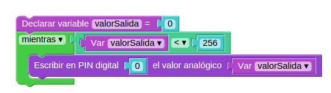
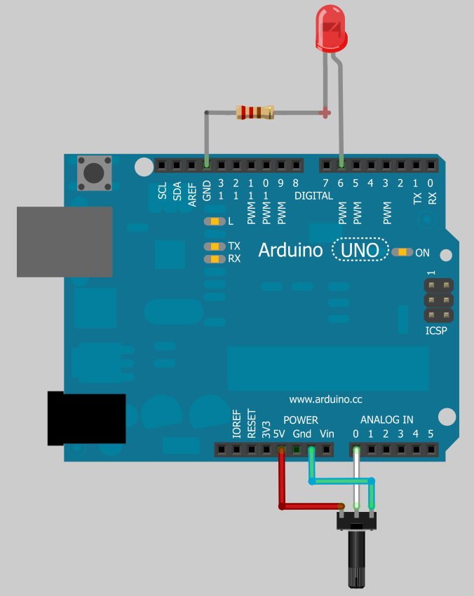
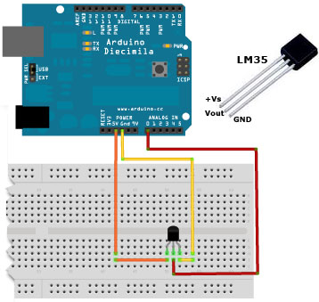

* * *

# Curso básico de Arduino

### José Antonio Vacas @javacasm

* * *

# Arduino

## Así lo vemos nosotros

[más detalle](imagenes/ArduinoUno_R3_Front.jpg)

* * *

## Así es internamente
#### (mucho por descubrir)

* * *

# Para programar necesitamos:

* ### Programa

* ### Montaje

#### (descargar el programa en la placa)

* * *

### ¿Qué es un programa? un conjunto de instrucciones ordenadas

#### Programa parpadeo (blink)

* Encendemos
* Esperamos
* Apagamos
* Esperamos
* Volvemos al principio

* * *

## Programando con Bitbloq

### http://bitbloq.bq.com

Programa parpadeo

* * *

### Usaremos el led interno

#### Ejercicio: Cambiar la velocidad de parpadeo

* * * 

## Con led externo

### Montaje sencillo

[detalle led](imagenes/300px-LED.png)

* * *
### Montaje con placa prototipo

[Placa prototipo](imagenes/breadboard1.gif)

#### Ejercicio: Cambiar el pin utilizado al pin 2

* * *

### Esquema

* * *

## Con relé

#### Ejercicio: Cambiar al pin del esquema

* * * 
## Veamos un poco de código

	void setup()
	{
	  pinMode(13,OUTPUT);
	}

	void loop()
	{
	  digitalWrite(13,HIGH);
	  delay(1000);
	  digitalWrite(13,LOW);
	  delay(1000);
	}

#### Ejercicio: Cambiar al pin del esquema
#### Ejercicio: Cambiar el pin utilizado al pin 2
* * * 
# Envío de datos serie

### La comunicación serie se produce via USB entre Arduino y el PC

* Detectamos el puerto
* Configuramos la velocidad
* Necesitamos un programa para ver los datos

## Vamos a enviar "Encendido" y "Apagado" al PC

* * * 
# Escritura de valores analógicos

## Usando técnicas como PWM podemos simular valores intermedios: 0 - 255
### (sólo en algunos pines)

## Vamos a hacer que cambie: usaremos una variable

### Si vemos el código

	void setup()
	{
	  pinMode(0,OUTPUT);
	}

	void loop()
	{
	  int valorSalida=0;
	  while (valorSalida < 256) {
	    analogWrite(0,valorSalida);
	    delay(100);
	   }

	}

* * *
# Led RGB: 3 led (Red,Green,Blue) con una de las patillas común

## Positivo (Ánodo) Común

## Negativo (Cátodo) Común

## Tiras de leds: Necesitamos más potencia por lo que usaremos un transistor como amplificador.

### El montaje es sencillo

* * *

# Lectura de datos analógicos

## Sensores (luz, temperatura)

## Potenciómetro: resistencia bariable

### El código:

	void setup()
	{
	  pinMode(5,OUTPUT);

	}

	void loop()
	{
	  int valorPotenciometro=analogRead(0);
	  int ValorSalida=map(valorPotenciometro,0,1023,0,255);
	  analogWrite(5,ValorSalida);
	}

### Ejercicio: usar 3 potenciómetros para controlar los colores de un led RGB

* * * 

# Para los sensores:

* lectura
* Conversiones (aritmética/mapeo)
* Calibraciones

* * *
# Sensor de temperatura LM35

float valor*5*100/1024 //valores máximos

int sensorPin=A0;

void setup()
{
	Serial.begin(9600);
}

void loop()
{
	int sensorValue= analogRead(sensorPin);
	float temperatura=(sensorValue*5*100)/1024; // float para tener decimales
	Serial.println(temperatura);
	delay(1000);
}

* * *

# Pulsaciones: botones

* * *

# LCD

* * *
¿Qué es una librería?
Ejemplo: [lcd](http://arduino.cc/en/pmwiki.php?n=Reference/LiquidCrystal) o [servo](http://arduino.cc/en/pmwiki.php?n=Reference/Servo)

[Librería LCD MF](https://bitbucket.org/fmalpartida/new-liquidcrystal/wiki/Home)
[Ejemplos lcd](http://arduino-info.wikispaces.com/LCD-Blue-I2C#v3)
[Ejemplo bq](http://diwo.bq.com/programando-lcd/)
* * *
# Agradecimientos:

[Arduino](http://arduino.cc)
[Adafruit](http://adafruit.com)
[Sparkfun](http://sparkfun.com)
[wikipedia](http://es.wikipedia.org)
[José Pujol](https://tecnopujol.wordpress.com)