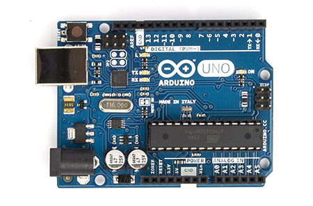
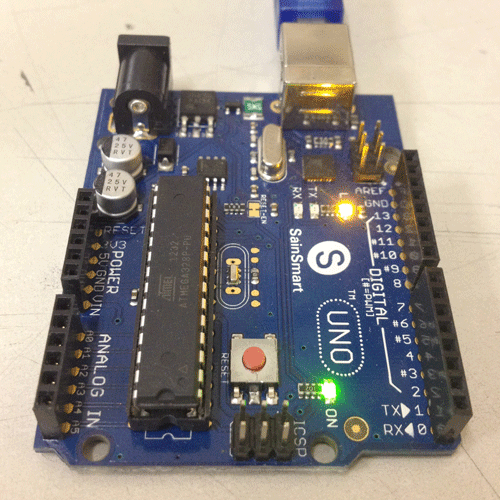

* * *

# Curso básico de Arduino

### José Antonio Vacas @javacasm

* * *

# Arduino

## Así lo vemos nosotros

[más detalle](imagenes/ArduinoUno_R3_Front.jpg)

* * *

## Así es internamente

* * *

# Parpadeo (blink)

### Necesitamos:

### * Programa

### * Montaje

#### (descargar el programa en la placa)

* * *

### ¿Qué es un programa?

#### Programa parpadeo

* Encendemos
* Esperamos
* Apagamos
* Esperamos
* Volvemos al principio

* * *

## Programa bitbloq

* * *

### Usaremos el led interno

* * * 

## Con led externo

### Montaje sencillo

* * *
### Montaje con placa prototipo

[Placa prototipo](imagenes/breadboard1.gif)

* * *

### Esquema

* * *

## Con relé

* * * 
## Veamos el códido

	void setup()
	{
	  pinMode(13,OUTPUT);
	}

	void loop()
	{
	  digitalWrite(13,HIGH);
	  delay(1000);
	  digitalWrite(13,LOW);
	  delay(1000);

	}

* * * 
# Agradecimientos:

[Arduino](http://arduino.cc)
[Sparkfun](http://sparkfun.com)