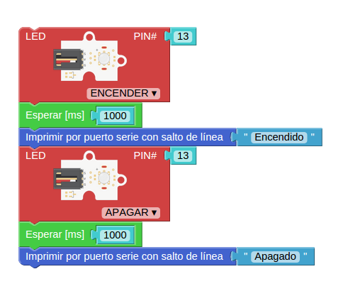

* * *

# Curso básico de Arduino

### José Antonio Vacas @javacasm

* * *

# Arduino

## Así lo vemos nosotros

[más detalle](imagenes/ArduinoUno_R3_Front.jpg)

* * *

## Así es internamente

* * *

# Parpadeo (blink)

### Necesitamos:

### * Programa

### * Montaje

#### (descargar el programa en la placa)

* * *

### ¿Qué es un programa?

#### Programa parpadeo

* Encendemos
* Esperamos
* Apagamos
* Esperamos
* Volvemos al principio

* * *

## Programa bitbloq

### http://bitbloq.bq.com

* * *

### Usaremos el led interno

#### Ejercicio: Cambiar la velocidad de parpadeo

* * * 

## Con led externo

### Montaje sencillo

[detalle led](imagenes/300px-LED.png)

* * *
### Montaje con placa prototipo

[Placa prototipo](imagenes/breadboard1.gif)

#### Ejercicio: Cambiar el pin utilizado al pin 2

* * *

### Esquema

* * *

## Con relé

#### Ejercicio: Cambiar al pin del esquema

* * * 
## Veamos un poco de código

	void setup()
	{
	  pinMode(13,OUTPUT);
	}

	void loop()
	{
	  digitalWrite(13,HIGH);
	  delay(1000);
	  digitalWrite(13,LOW);
	  delay(1000);

	}

#### Ejercicio: Cambiar al pin del esquema
#### Ejercicio: Cambiar el pin utilizado al pin 2
* * * 
# Envío de datos serie

### La comunicación serie se produce via USB entre Arduino y el PC

* Detectamos el puerto
* Configuramos la velocidad
* Necesitamos un programa para ver los datos

## Vamos a enviar "Encendido" y "Apagado" al PC

* * * 
# Lectura de datos analógicos

Sensores (luz, temperatura)

lectura
Conversiones (aritmética/mapeo)
Calibraciones
Actuacion

LM35
float valor*5*100/1024 //valores máximos

* * *

# LCD

* * *
¿Qué es una librería?
Ejemplo: [lcd](http://arduino.cc/en/pmwiki.php?n=Reference/LiquidCrystal) o [servo](http://arduino.cc/en/pmwiki.php?n=Reference/Servo)

[Librería LCD MF](https://bitbucket.org/fmalpartida/new-liquidcrystal/wiki/Home)
[Ejemplos lcd](http://arduino-info.wikispaces.com/LCD-Blue-I2C#v3)
[Ejemplo bq](http://diwo.bq.com/programando-lcd/)
* * *
# Agradecimientos:

[Arduino](http://arduino.cc)
[Adafruit](http://adafruit.com)
[Sparkfun](http://sparkfun.com)
[wikipedia](http://es.wikipedia.org)